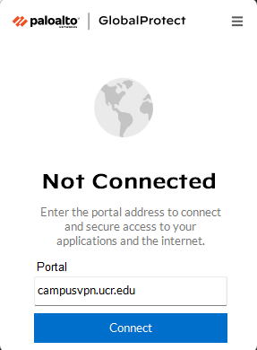
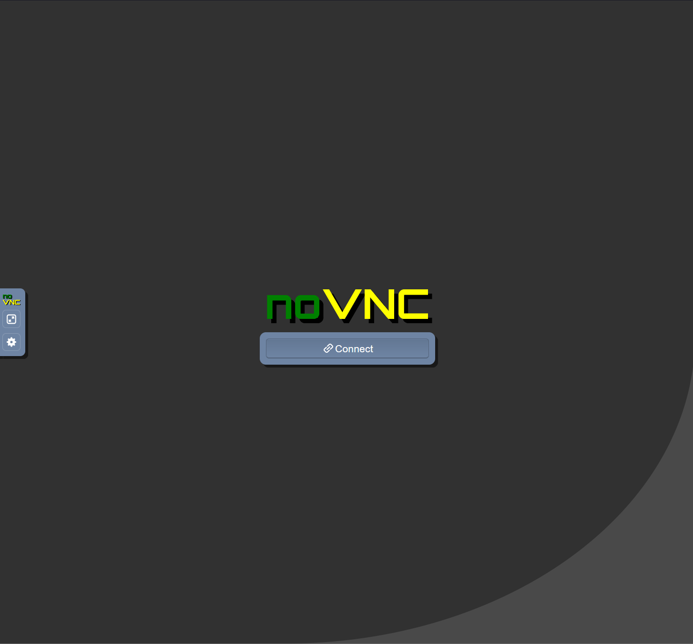

# EE267_LAB0: Access Carla

First steps will be to install Carla onto the system or to access Carla via
the web portal. We will go over the steps required for each. 

## 1. Accessing Carla via Web Portal ##
First step is to go UCR Library website and install the schools VPN. This allows for access
to the server while not being on the schools WiFi. 
[You can view the instructions here to install the VPN](https://library.ucr.edu/using-the-library/technology-equipment/connect-from-off-campus)

After the VPN is installed you will need to navigate to your Global Protect VPN in the icon
bar. It should look like this:


<p align="center">
  
</p>

After clicking on the icon, you will enter
```
    campusvpn.ucr.edu
```
Then click on "Connect". You will then have to enter your standard UCR login credentials.
The username is your UCR email address (e.g. jsmith@ucr.edu) and password is your UCR password.

Once connected, you will see a new network connection called "campusvpn.ucr.edu".
Now that we are connected to the school's VPN, we can now connect to the Carla server.

To do so, you will refer to the email provided by the TA with the server URL and password.
The email will look something like this: https://rtx-"enter port here".cs.ucr.edu/

After entering the url into your browser, you will see a webpage similar to this:
<p align="center">
  
</p>

Click on "Connect" and enter the password given in the email. Once logged in,
you will see a screen and will be prompted to enter your password again. After doing so, you will now be fully logged in. And are now ready to start using Carla!


## 2. Installing Carla locally on Machine ##

This step is more difficult as it requires an manual install of Carla and hardware powerful enough to run
it. 

### Hardware Requirements ###


# Create & Source Environment #


# Install Required Libraries/Dependencies #


# Running Project Files #

